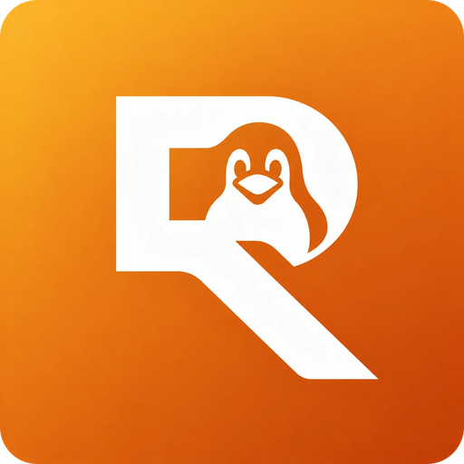

#  **Reoling**  

An unofficial client for Reolink® devices — cameras, NVRs, and Home Hubs —
that connects over Reolink's proprietary "Baichuan" P2P protocol using only
a device's UID (no manual IP/port configuration, no cloud account required).

Reoling is not affiliated with, endorsed by, or sponsored by Reolink.
"Reolink" is a trademark of its respective owner.

## Status

Version **0.1.2**, early development. Login and live video work end to end
against real hardware (a Home Hub, an NVR and their cameras), over UDP/P2P
only: Reoling races the device's local, NAT-mapped and relay addresses at
the same time and uses whichever answers first, as the official client does.

**What the app does today**

- Devices: add by UID or IP; every saved device connects at start and shows
  *Connected* / *Not connected*; one password per device, kept in the desktop
  keyring; the device's own name, channels (with their names) and the streams
  each channel offers (main / extern / sub) are read from the device.
- Live view: click a device or one of its channels; the lightest stream is
  the default; Stop freezes the picture and becomes Play; the last stream
  restarts on the next start; fullscreen with a control bar that slides in;
  a latency setting (Low / Balanced / Smooth) trades reaction time for
  smoothness over a poor connection.
- Sound: the stream's audio with a volume control; Talk (microphone to the
  camera, ADPCM).
- Camera controls, shown per channel from what the camera reports: siren,
  spotlight, and — in a separate "Camera control" window, independent of the
  main window — pan/tilt (hold a direction to move), zoom and focus (read
  back from the camera after every change, since zooming makes it
  autofocus), and PTZ presets (save, go to, delete).
- Snapshot (PNG in `~/Pictures/Reoling`) and recording (MKV in
  `~/Videos/Reoling`).
- Settings: theme (Auto / Light / Dark), decoding (Auto / Hardware — with the
  decoder to use if there are several — / Software), latency. Colours are
  the active theme's.

**Not done yet**

- Playback (the tab is a placeholder), Split View.
- PTZ calibration and Monitor Point: not implemented — no reference
  implementation documents their messages, and reading them from a capture
  of the official app needs its session decrypted, which needs its
  password.
- Deleting a PTZ preset sends `delPos` (this project's best guess, matched
  against message counts in a capture, not against decrypted bytes — but
  confirmed working, deletion included, against a real camera).
- Packaging (see [Installation](#installation)).
- Talk has been built from the official app's captured messages but is the
  least tested part.

**Version history**

- 0.1.2 — camera remote in its own window: zoom, focus (both read back after
  a change), PTZ presets (save / go to / delete); a latency setting.
- 0.1.1 — camera controls (siren, spotlight, pan/tilt, talk), snapshot,
  recording, audio, settings, per-channel streams, stop/play, fullscreen bar.
- 0.1.0 — protocol, P2P discovery, login, live video, first UI.

## How it works

Reoling implements the Baichuan protocol from scratch, in Rust, based on
observed wire behavior (see [Acknowledgments](#acknowledgments)). It never
requires the official Reolink cloud account or app — you connect directly
to a device by its UID, and Reoling resolves the P2P path itself.

A UDP receive task keeps draining the socket and acknowledging packets
independently of the video pipeline, and every video frame is pushed
straight into GStreamer from the network thread, so a busy GTK main loop
never affects playback. GStreamer's `decodebin` picks the best available
decoder (hardware or software).

## Project layout

```text
src/
├── protocol/    Wire protocol only: binary framing, XML, BCEncrypt/AES.
│                No I/O, no async runtime — a pure, testable codec.
├── transport/   P2P/UDP: UID resolution, NAT traversal, relay fallback,
│                and the reliable BCUDP connection.
├── client.rs    Client/session API: login and live video.
├── talk.rs      ADPCM encoding for Talk.
├── ui/          GTK4 + GStreamer desktop app (main window, sidebar,
│                dialogs, settings, video and audio).
└── main.rs      The `reoling` binary.
examples/        Small diagnostic tools (UID probe, media trace analysis).
data/            Icons.
```

Reoling is a Linux-only desktop application.

## Installation

Not yet packaged. Planned distribution once the app reaches a usable
state:

- **Ubuntu / Debian**: a `reoling_<version>_amd64.deb` package.
- **Linux, distro-independent**: a `Reoling.AppImage` build.

Until then, build from source (see below).

## Building from source

Requires:

- Rust (edition 2021, `rust-version` 1.75+ — see `Cargo.toml`)
- GTK4 (`>= 4.6`, Ubuntu 22.04's baseline) and its development headers
- GStreamer, including `gstreamer-app`, the GTK4 paintable sink
  (`gstreamer1.0-gtk4`) and a decoder plugin (`gstreamer-libav` for
  software decoding; VA-API/NVDEC plugins for hardware decoding)

```bash
cargo build --release
cargo run --release
```

Add a device with the **+** in the device list (its UID, or IP and port),
then log in with the device's username and password. `--prefer-tcp` is a diagnostic-only flag that tries a
direct TCP connection when the device is reachable that way; the normal
path is always UDP/P2P.

To run the full test suite (protocol codec, transport and session logic —
no real hardware required):

```bash
cargo test
```

## License

AGPL-3.0-or-later — see [LICENSE](LICENSE) for the full text and
third-party component notices (GTK4, GStreamer, and the Rust crates
Reoling depends on).

## Acknowledgments

Reoling's understanding of the Baichuan protocol was built by reading
(never copying code from) other reverse-engineering efforts, most notably
[neolink](https://github.com/QuantumEntangledAndy/neolink) and Reolink's
own [reolink-cli](https://github.com/reolink/reolink-cli) (LAN-only,
closed-source, documentation only). See [LICENSE](LICENSE) for the full
list and their own licenses.
